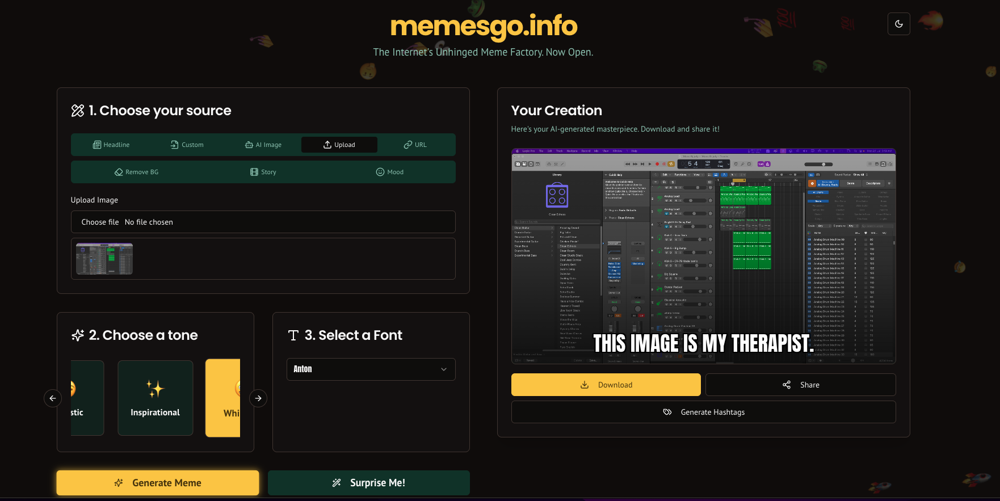

# 🖼️ AI Meme Generator - memesgo.info

Generate memes with the power of AI in seconds.



---

## 🚀 Features

This app is packed with features to unleash your creativity:

*   **Multiple Meme Sources:**
    *   📰 **Trending Headlines:** Automatically fetches trending (mock) news headlines to generate topical memes.
    *   ✍️ **Custom Text:** Write your own headline or idea.
    *   🤖 **AI Image Generation:** Describe a scene, and the AI will generate a unique background image for your meme.
    *   🔗 **Image from URL:** Paste a URL to any image on the web.
    *   ⬆️ **Upload Your Own:** Use your own photos as meme templates.
*   **Advanced AI Tools:**
    *   🎞️ **AI Story Generator:** Provide a prompt and get a 3-panel meme story with AI-generated images and captions.
    *   😊 **Mood-Based Memes:** Let the app use your webcam to detect your mood and create a personalized meme.
    *   ✂️ **Background Remover:** Upload an image and let the AI remove the background.
*   **Customization:**
    *   🎭 **Tone Selection:** Choose from different tones like *Funny*, *Sarcastic*, *Inspirational*, or *Whimsical* to guide the AI's caption generation.
    *   ✒️ **Font Options:** Select the perfect font style for your meme's text.
*   **Social & Sharing:**
    *   #️⃣ **Hashtag Generation:** Automatically generate relevant and trending hashtags for your meme.
    *   🔽 **Download & Share:** Easily download your creation as a high-quality PNG and share it across social media platforms.
*   **Sleek UI:**
    *   🎨 **Modern Design:** Built with ShadCN UI and Tailwind CSS for a clean, responsive, and aesthetically pleasing user experience.
    *   ☀️/🌙 **Light & Dark Mode:** A beautiful theme that adapts to your system preference.

---

---

## 🛠️ Tech Stack

This project is built with a modern, full-stack TypeScript architecture:

*   **Framework:** [Next.js](https://nextjs.org/) (React Framework)
*   **AI/Generative:** [Google AI Studio (Gemini)](https://ai.google.dev/) via [Genkit](https://firebase.google.com/docs/genkit)
*   **UI Components:** [ShadCN UI](https://ui.shadcn.com/)
*   **Styling:** [Tailwind CSS](https://tailwindcss.com/)
*   **Language:** [TypeScript](https://www.typescriptlang.org/)

---

## 🏁 Getting Started

To get a local copy up and running, follow these simple steps.

### Prerequisites

You need to have [Node.js](https://nodejs.org/) (version 18 or later) and npm installed on your machine.

### Installation & Setup

1.  **Clone the repository:**
    ```sh
    git clone https://github.com/your-username/your-repo-name.git
    cd your-repo-name
    ```

2.  **Install NPM packages:**
    ```sh
    npm install
    ```

3.  **Set up your environment variables:**
    *   You'll need a Google AI (Gemini) API key. You can get one from [Google AI Studio](https://aistudio.google.com/app/apikey).
    *   Create a `.env` file in the root of the project.
    *   Add your API key to the `.env` file:
        ```env
        GEMINI_API_KEY=YOUR_API_KEY_HERE
        ```

4.  **Run the development server:**
    ```sh
    npm run dev
    ```

Open [http://localhost:3000](http://localhost:3000) with your browser to see the result.

---

## ❤️ Contributing

Contributions are what make the open-source community such an amazing place to learn, inspire, and create. Any contributions you make are **greatly appreciated**.

If you have a suggestion that would make this better, please fork the repo and create a pull request. You can also simply open an issue with the tag "enhancement".

1.  Fork the Project
2.  Create your Feature Branch (`git checkout -b feature/AmazingFeature`)
3.  Commit your Changes (`git commit -m 'Add some AmazingFeature'`)
4.  Push to the Branch (`git push origin feature/AmazingFeature`)
5.  Open a Pull Request

---

## ☕ Support

If you like this project and want to support its development, please consider buying me a coffee!

<a href="https://coff.ee/mahas" target="_blank">
  
</a>
